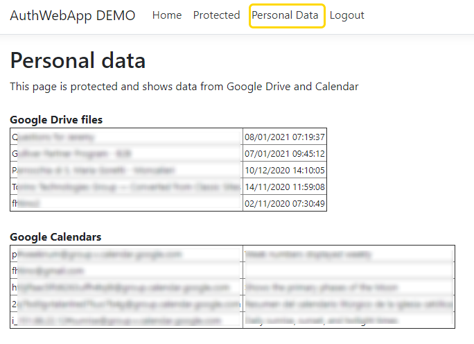

# google-stuff

Test, demo and misc stuff about Google services, APIs and so on.

## Auth WebApp+Background+Lib
**!!! THIS IS A DEMO !!!**   
**!!! DO NOT USE this code in production !!!**  
**!!! The RefreshToken storage is not secure !!!**  

This set of two applications demostrates the possibility to:
 - authenticate a user on a web application (asp.net core).
 - get his/her refresh token.
 - use the refresh_token in a background (daemon) process to access Google services on behalf of the user.

Everytime a user successfully logins on the web-application, with the required scopes, 
the corresponding refresh_token is stored and reused in the background application, simulated here with a console-application. 
For the aim of this demo, the refresh_tokens are stored in an insecure json file, 
shared between web-applicationa and console-application. 
A real application requires a secure and encrypted storage.  
  
Newly created refresh tokens are intercepted in Statup --> OnTokenValidated

Google OAuth secret json filename and shared json storage filename are both passed as environment variable: 
CLIENT_SECRET_FILENAME_PATH  and DEMOSTORAGE_FILENAME

 

  

 
 
 

  
 
 
 

  
 
 